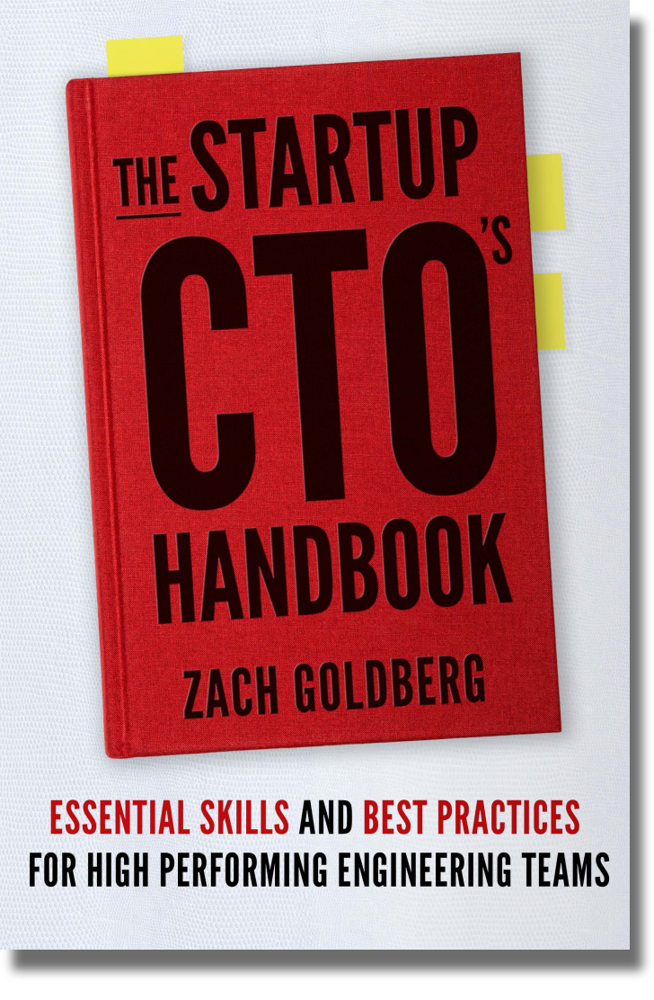

  

# The Book
You can view the latest content of the book in markdown [here](StartupCTOHandbook.md)

You can buy the book on [Amazon](https://www.amazon.com/dp/1955811563) or [Audible](https://www.audible.com/pd/B0CXB5YZL2)

(Coming Soon) Link of the latest version of the markdown rendered to PDF

The original manuscript (now outdated) can be found as a [Google doc](https://docs.google.com/document/d/147KVarJdNQ2ZdmDHOSsd7W39anejRu2NfxEWCzwl0IU/edit)

# Welcome
Hi, thanks for checking out the Startup CTO's Handbook!  This repository has the latest version of the content of the book. You're welcome and encouraged to contribute issues or pull requests for additions / changes / suggestions / criticisms to be included in future editions. Please feel free to add your name to ACKNOWLEDGEMENTS if you do so.

# The Author
[Linkedin](https://www.linkedin.com/in/zachgoldberg/) / [Website](https://zachgoldberg.com) / [Email](mailto:zach@zachgoldberg.com)

# Licensing
See the LICENSE file, but tl;dr - you're welcome to make copies, changes, redistribute etc. so long as you're not reselling, you keep my name/attribution attached, and you keep future versions open under a similar/the same license.

